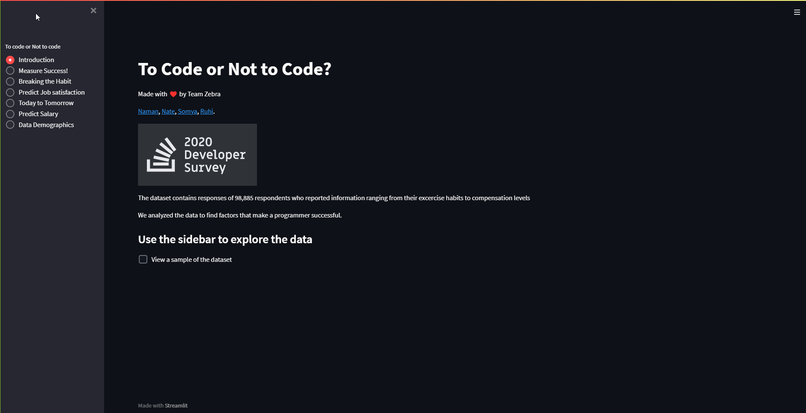
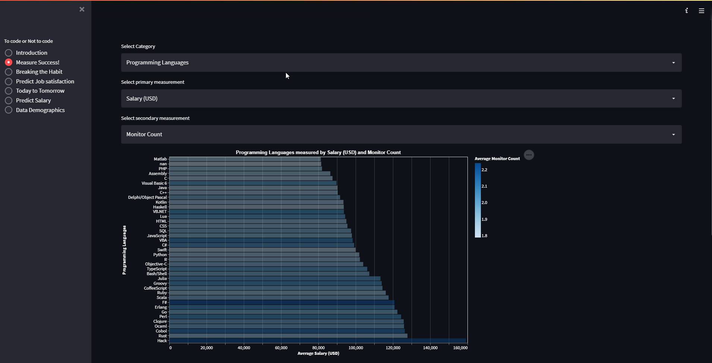
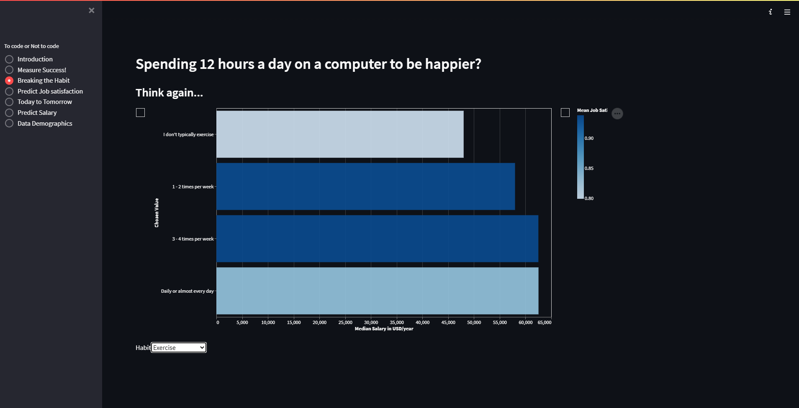
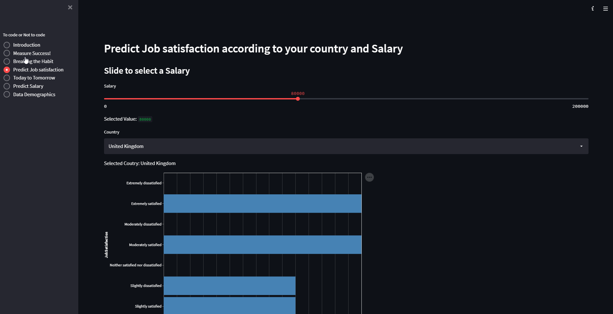
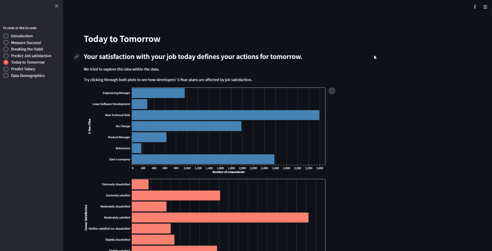
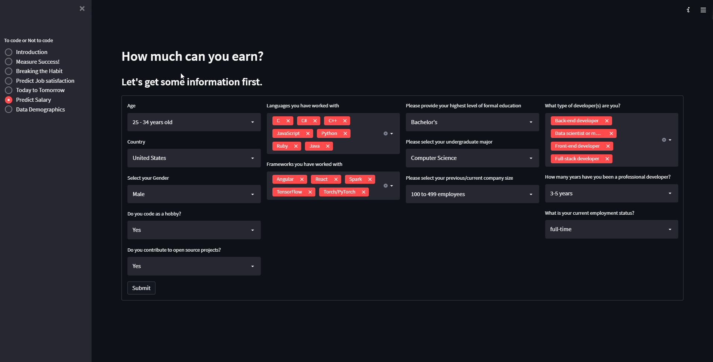
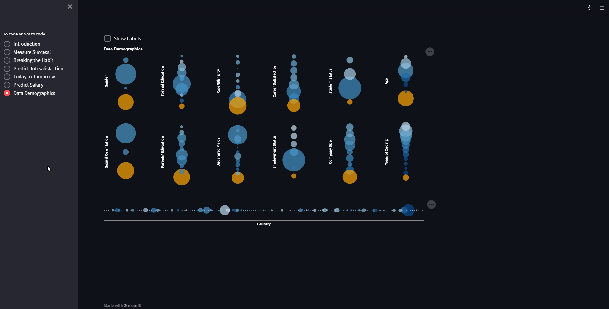

# **Team Zebra: Interactive Data Science Final Project**

## **To Code or Not to Code**

### Project URL: 
[https://share.streamlit.io/cmu-ids-2022/final-project-zebra/main/StackOverFlow.py](https://share.streamlit.io/cmu-ids-2022/final-project-zebra/main/StackOverFlow.py)

### Video URL: 
[YouTube](https://youtu.be/Cxr6KGg0IkE)

The IT industry has experienced exponential growth in the last decades. We feel that it is worthwhile to explore the contributing factors that would make a Software Developer successful. 

“What makes a programmer successful?", was the question is started out with as part of the proposal. This question was left intentionally broad, to allow the user to project their own perception and line of inquiry onto it, prompting them to explore the data. For example, the pragmatic (and financially motivated) reader might be interested in the answer to the sub-question “what computer language should I learn to make the most money?" Another, more socially oriented user might wonder about the gender dynamics. A third viewer might be curious about exploring the relation of salary to career satisfaction. All three users have, in a way, asked “what makes a programmer successful”, with different means of generating success, and different definitions of success itself.

We have developed a solution that helps the user predict their job satisfaction, salary and explore the causes for satisfaction/dissatisfaction by interacting with our application. We have also introduced a fresh take on the stigma associated with the life of a developer in terms of personal habits like exercise frequency, meal skipping, hours spent on computer etc. 

The project is centered around exploring the insights collected from the [Stack Overflow 2020 Developer Survey](https://insights.stackoverflow.com/survey/2020). We performed heavy data cleaning to bring the data into a workable format. Our vision throughout was to give the user maximum flexibility to freely understand and explore the data. Since a lot of users in the survey also shared Salary information, we attempted to build a regression model to predict the salary that a candidate can expect to earn given a certain set of parameters.  

The target audience for the application is anybody who is interested in a career that involves writing code, or somebody who is already in the field but looking to explore how the industry has evolved, and where it is headed. The insights can be used to influence decisions about which skill to learn next, and which area is best suited for investing one's time in, so that output can be maximized. 

# **Introduction**

The IT industry is only second to the Healthcare industry in terms of adding to the US GDP, contributing up to 10.5% to the US GDP. Moreover, the industry is projected to grow up to about 6% [1] year on year. With the growth of the IT industry, there are more and more job opportunities being created in the tech space, and the employment rate in tech fields is projected to grow up to 13% [2]. Software development is one of the most sought-after tech occupations. From working styles and sleeping habits to core skills, there are many factors that go into becoming a successful software developer. This is where we want to help upcoming software developers by giving them a comprehensive breakdown of various factors that lead to high career and job satisfaction. For this project, we have used the software developer survey by Stack Overflow, which is an annual 30-min survey given out to the Stack Overflow community. The database consists of around 98,885 survey responses and 130 columns. We have worked with the dataset to provide a helpful dashboard, to answer the questions: “_What makes a programmer successful?”_. The columns we are utilizing as a metric for the “success” of a programmer are Job and Career Satisfaction level, and Converted Salary (reported salaries converted to USD). The input factors that we are considering for evaluating the success of a programmer are: Personal Habits, such as exercise frequency, meals skipped in a week, hours spent on the computer, wake-up time; Demographic information such as Age, Gender, Country,  Education; Tech skills: Languages worked with, etc. 

As a part of this project, we have also made a salary prediction model, which takes in features ranging from Age, Country to Languages, and Frameworks worked with and gives an expected salary (in USD) as output.

# **Related Work**

For more detailed and comprehensive insights into the survey results, Stack Overflow builds its own dashboard based on the survey results and breaks down their analysis into Technology, Developer profile, Work, and Community categories. Their data science and analytics strive to highlight the factors that help Stack Overflow become more inclusive of underrepresented genders and ethnicities[4]. 

For instance, this year the focus of the survey was to design a survey that highlighted the progress made by these underrepresented groups in terms of their interactivity with the platform. Furthermore, their analysis is driven towards comparing year-on-year trends which helps in estimating the website’s growth and the emerging trends. Their analysis is catered toward making the platform more inclusive, for instance, they have studied the features that different demographic groups want to be added to the platform, and women wanted to add more reformative features for the communication on the website. Whereas the men wanted more tech-related features to be added to the platform. 

Moreover, researchers have evaluated the internal and external consequences of unhappy software developers [5]. According to their research, unhappy software developers suffer from various personal drawbacks such as low-performance capabilities at work, poor problem-solving abilities, increased panic attacks, and overall poor mental health. Moreover, they also suffer from low motivation and face work-related withdrawals. The external factors affected due to the unhappy state of the software developers are low productivity (productivity-related losses), less conforming to following organizational processes, and exhibiting diligence resistance.  Moreover, their work quality is also affected as it affects the code quality, in turn affecting the product quality and jeopardizing the work done by the others in the team [5]. This work has inspired us to aid the upcoming software developer, by showing them informative and comprehensive visualizations which help them to decide the factors they should keep in mind with respect to their own definition of “success” in the field, be that job satisfaction, career satisfaction or salary. 

# **Methods**

Our initial direction to work with was to realize our sketches. However, on exploring the data a little deeper we found that it was very dirty and needed a high amount of pre-processing to make it workable. We did have the initial direction of the format we would have preferred our dataset to be in, so we needed to work through the process of meeting these requirements. 

## **Data Cleaning**

Our priority of working with this problem remained to maintain all of our work as reusable. Since there were four members working on different parts of the project, but all of them stemmed from the same dataset, this was key. We wanted to minimize the amount of rework we would need to do. 

Another design decision we made was to complete all of the cleaning and imputations offline. We wanted to make the experience of the user navigating through the application as seamless as possible, thus pushing all of the computational load offline was an easy solution. This also reduced the final size of our dataset as we were able to get rid of some null values, and reduce the size of some labels by changing them to short-form labels that were easier to read and took less storage space to store. 

A major hurdle that we had to overcome was the large size of the dataset. In uncompressed form, the raw dataset surpassed 300MB in size. Since we needed to use Streamlit as our deployment platform, this would have been an issue. As a workaround, we performed all of our data cleaning and manipulation processes on a collaborative Python notebook on DeepNote as well as Trifacta. After the data was brought to a relatively clean state, we decided to host it on a public Azure blob storage. This way, we could have the streamlit app directly fetch it from the cloud instead of trying to squeeze it into the github repository. 

## **Measure Success**

A wide variety of users visit Stack Overflow for a wide variety of needs. “Noobs” and experienced programmers, 

There is a simple reason for the existence of this visual - freedom. The dataset is extremely rich in terms of the features that have been recorded, it represents a huge diversity that the software developer community has given rise to. 

## **Breaking the Habit**

This plot is made using a selector entirely in Altair. The decision to not take input from Streamlit has helped us keep user interaction lightning fast. The idea of using a selector was incorporated to avoid having the user scroll through multiple plots, and probably missing out key information that would stand out on a single plot targeted at a single parameter. 

We decided to add the job satisfaction as another dimension encoded using the color (gradient). This helps quickly highlight the takeaway from the visual, avoid information fatigue and keeps the visual simple. 

## **Predict Job Satisfaction**

While the name of the dashboard does say predict, we are not using machine learning models here. We are benefitting from the massive amount of data we had access to.We calculated the distance of each data point from the salary entered by the user on the streamlit dashboard. We have used euclidean distance as a metric to calculate the 10 nearest neighbors. Further we ranked those 10 neighbors according to the distance. For example, the neighbor with the sample distance to the salary value selected by the user would be assigned rank =1. We used the ranks to predict the job satisfaction of the user according to the salary and country input, based on the ranks of neighbor reponses after normalizing the ranks. In this manner, the results are normalized according to the users that are earning the closest to the value entered by the user, and slightly more accurate results are obtained as compared to basic filtering. We found this approach to act as a good heuristic, and not being complex like a machine learning model. 

## **Today to Tomorrow**

Since this plot was inspired by how workforce frustration directly inspires and motivates employee churn/attrition, it was our objective from the beginning to make it interactive. We make the use of bar plots to make comparisons easier across both the plots. Additionally, the two plots are colored differently as visual aid to convey that different ideas are represented in both the plots. We added the option for two-way interactivity here as well, to allow the user to explore the effects of job satisfaction on long term goals, and how long term goals define job satisfaction.

We decided against using statistical measures like mean or median for this plot as the data could be skewed to specific classes. For example, you will definitely see fewer people opting to go for retirement as compared to those wanting to start a new company. 

## **Salary Prediction**

Since we had access to the salary numbers provided by several of the survey respondents, we decided to explore the possibility of training a Machine Learning model to predict the salary of a developer. There is only a finite amount of variability possible in the features that determine how much a developer would earn, and that is what we wanted to take advantage of. The target (dependent) variable here would be salary. Also, since the respondents were from several different nationalities, comparing absolute salaries would not have been an accurate thing to do. To counter this, we utilized another feature available in the dataset called ConverteSalary. This is an auto-calculated field which represents the salary of the respondent in USD per year. Given this number, we could have a uniform data distribution and expected to have a fairly accurate model churned out. 

For the Machine Learning model, we decided to go with a Random Forest Regressor. The primary reason for choosing a tree-based model was because most of the features that we thought would actually contribute to the salary were categorical variables. We came up with this knowledge using our collective past industry experiences and domain knowledge, having worked in the same field for several years. A linear model was out of the question due to lack of a single numerical variable. Even the user’s age was binned in the survey, so features that could have been numerical also ended up being categorical in the way that the survey was structured. A random forest was chosen to help build a robust model using ensemble learning. 

The model was trained using a GridSearch to find the best hyperparameters. We wrote a custom ColumnTransformer to multi-hot encode categorical features. As part of the scikit-learn library, OneHotEncoder treats each label under each feature as a different class. However, this is where our dataset was a little tricky to work with. For certain features such as Languages Worked With, Frameworks Worked With, and Job Roles that the respondents identify themselves with, the survey was structured to accept multiple responses to a single question. For example, a user may be skilled in both Python and Java, and this would translate into a value of “Java;Python”. So, effectively we had several columns where the value could be a list of arbitrary length. As a solution to this problem, we attempted to use the MultiLabelBinarizer class within scikit-learn. However, this presented a new challenge. The MultiLabelBinarizer is designed to be used for the target (y) variable, hence it operates on only a single column. While we could theoretically apply the same fit/transform to all the features in the X dataset, we needed to make this operation supported by the scikit-learn pipeline class. So, the final approach used was to create a custom class that inherits MultiLabelBinarizer, BaseEstimator, and TransformerMixin. This is available as MyBinarizer.py in the github repository. Upon instantiating the class within the ML modeling script, we can directly call its fit and transform methods to get the desired effect of generating multi-hot encoded variables. While the approach took some time to develop and perfect, but now that it has been made, it can be used to multi-hot encode any kind of features. 

The trained ML model was packaged into a scikit-learn pipeline and exported to a pickle file using joblib. This was done because before we started, we knew that the ML model would expect data in a format that would be vastly different from how it would be accepted from the user-facing endpoint. For example, while the model would be trained on multi-hot encoded values, the user would still have to use a checkbox-like design to provide input to the model. To work around the issue of doing the same thing over and over again, scikit-learn pipeline comes to the rescue. We can simply pass the same values as raw data to the model object, and they are all automatically translated into the same format that the model expects them to be in. The model’s inference time turned out to be quite low (only a few milliseconds) because of this process. The output value is fetched directly and displayed on the streamlit front-end. 

A design decision was also taken at this point. Just displaying a value of the predicted salary might not have made a lot of sense to the user. We wanted to incorporate shapely values using the SHAP python module, but it did not work out due to technical challenges of getting it to work with a scikit-learn pipeline. So, we instead decided to show the user where they stood compared to all the other individuals in the country. This was achieved through a histogram, and highlighting the bin that the user belonged in. The data manipulations for this chart were done on the fly depending upon output from the model. 

# **Results**

## **Structure**

To make the narrative cohesive, and prevent information overload for the user, we decided to split our visuals into five different screens. We made use of radio buttons on the streamlit sidebar to achieve this, and it allowed the user to select which information they wanted to explore and interact with. This aided in providing structure to our application.

## **Measure Success**

Some very interesting insights have come out of this dashboard. And the good thing about this one is, the more you explore it according to your own interests, the more it might just keep on giving. We would like to highlight some of the key findings that we’ve come across during our exploration of the data using this dashboard, but the window remains open for finding something novel with a different combination of the feature sets. 

## **Breaking the Habit**

The dataset consisted of a lot of information around lifestyle habits followed by developers. This dashboard allows users to efficiently explore if the stereotypes that they have grown to know and get accustomed to are actually true or not. For example, an interesting insight realized from this dashboard is that contrary to popular belief, burning the midnight oil and staying up long hours does not really translate to career success. Neither does it get you a higher salary, nor does it lead to a higher job satisfaction. Early to bed, early to rise, makes a developer rich, satisfied, and wise!  

A similar observation was made from trends in exercising habits. The most satisfied and most money-making developers lie in the category of people who exercise 3-4 times per week. This drives home the point of making physical fitness a priority in the sedentary lifestyle of software developers. 

## **Predict Job Satisfaction**

This plot helps a user understand just how much happiness would money really buy you in a particular country.We strategically used the country along with salary because we understand that cost of living can be different across countries.  We find that more money does not always lead to more satisfaction with jobs. The user can browse the trend through multiple countries and readily change the salary value using the slider to extract insights in this space. 

As the values are updated, we observe that there’s actually no real relationship between money and satisfaction. Some users that earn a lot of money are still not satisfied, while there’s a fraction of users across all salary ranges that remain moderately satisfied. Thus, we can conclude that satisfaction is a very relative concept. What means satisfying to you might not be the definition of satisfaction for somebody else, even if they share the same job roles and pay. 

## **Today to Tomorrow**

Interactivity of this chart is a key point here. The idea highlighted is that the level of satisfaction of a developer’s job today directly affects where a developer sees themselves five years down the line.  

If we look at the developers that say they are extremely dissatisfied with where they are in their careers, a majority of them see themselves as starting their own companies, closely followed by those wanting to move to a new technical role. This makes perfect sense and it is interesting to see that we could find something glaringly obvious being told precisely well by the data. 

## **Salary Prediction**

After playing around with the ML model we trained, we found that it was most responsive to skills and frameworks. So, we believe that this tool would be a great value-add for somebody who is just trying to find the next skill they should learn, and make sure that it would be worthy of their time. They can see just how much of a monetary impact it would make to have a new language or framework added to their current portfolio, and where it would rank them amongst their peers in the industry. 

# **Discussion**

We set out on this project with the objective of making this rich dataset more accessible to the general public, and allow the novice or rookie tech enthusiast to get a glimpse into the industry. We were able to find some great analyses and correlations that come across from the plots we’ve chosen, and they tie back well to the original problem statement. Our objective was to find the answer to the question, “What makes a programmer successful?”. Our plots coherently stay tied to the main idea, consistently adding value and allowing the user to get nudged into realizing how each small, individual factor contributes to the success and satisfaction of a developer. 

Additionally, our focus and our design language was to maintain flexibility and accessibility. The application achieves this purpose well. Especially with the “Measure Success” dashboard, where the user is free to explore the data to their own liking, we are able to potentially hit the sweet spot for every user with their own unique personal preferences. The key here was to make the visualizations easily relatable for our viewers, and adding all these different options to choose from means we have something for everyone. 

While the application we have developed produces some strong results and makes convincing arguments, it does come with an inherent bias that the data source has unfortunately brought with it. To highlight this bias and hence a limitation of our implementation, we created another dashboard titled “Data Demographics”. Here our motive was simply to understand exactly what kind of people have responded to the survey, and if our sample is truly representative of the original population. We find that there are certain groups of people that remain under-represented in our analyses. The respondents are predominantly white males (more than half), and about 30% of the respondents did not even share their gender. Thus, we decided not to include any analysis on gender within our application as the results might just end up being heavily skewed. On the other hand, this might just be indicative of the fact that women are in general outnumbered by men in the technology industry, which presents a broader problem in itself. 

# **Future Work**

As the stackOverFlow survey is done on a yearly basis, our recommendation for future work would be to combine data from multiple years to analyze the trends. For example, languages trending in the Top 5 languages for highest paid, analyze trends for new technologies etc  . One other potential area would be to explore the ways that developers educate themselves to learn and acquire new skills. For example, if the developers are preferring to learn through MOOCs (A model for delivering learning content online with no limit on attendance.)[3], then IT organizations can enable such programs to create home-grown talent. An additional analysis worthy of performing would be to compare these trends in changing salaries and prevailing skills against other external data sources. For example, we could compare how courses being taught at schools have evolved, how COVID has impacted the lives of developers, and how skills and salaries have adjusted in response to major events in the market.

We could not get SHAP to work with the scikit-learn pipeline this time, but this is something we would like research on and potentially find a workaround for. A force plot or summary plots showing just how much each feature contributes to an individual’s predicted salary would be a huge value-add to anyone in the industry, or anyone trying to get into the industry. Additionally, the ML model is pretty basic and only significantly responds to changes in languages and frameworks. As part of future work, we would like to explore a different data pipeline, encoding some categorical variables as ordinal instead of nominal, and try out boosted trees (XGBoost, AdaBoost algorithms) to make more robust models. We can also try attempting to train a neural network model, but then we would give up on the interpretability, which we believe is key to this use case. 

Also, while streamlit does a great job here, certain tools like Tableau might also be a good add-on to the application. Tableau also has a massive performance advantage, and can run lightning fast even in production environments and under high load. 

# References

[1] [Zippia Tech Industry Stats](https://www.zippia.com/advice/tech-industry-statistics/)

[2] [Computer and Information Technology Occupations](https://www.bls.gov/ooh/computer-and-information-technology/home.htm)

[3] [Massive Open Online Course (MOOC)](https://library.educause.edu/topics/teaching-and-learning/massive-open-online-course-mooc)

[4][StackOverflow Survey 2020](https://insights.stackoverflow.com/survey/2020#overview)

[5] [What happens when software developers are (un) happy. _Journal of Systems and Software](https://arxiv.org/abs/1707.00432)
